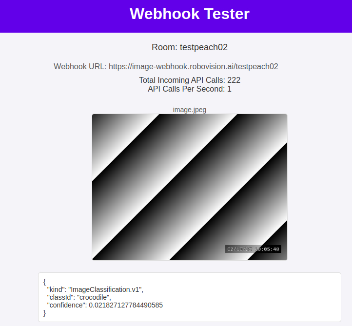

# Image Webhook

This repo demos a small webservice that visualizes POST requests made to its API.




## Development

```
npm install
npm start
```

## Running in Docker

Make sure to bump the version in `package.json`, then build the docker image with:

```
docker build . -t `jq .name package.json -r`:`jq .version package.json -r`
```

Test it with:
```
docker run -p 3000:3000 `jq .name package.json -r`:`jq .version package.json -r`
```


